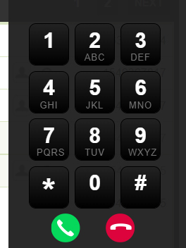

# Project for DSPL

## Task: 1

CRUD operation -> Create a CRUD operation module with 2 method's

1. Post method -> whatever values will be submitted should show on same page.
2. AJAX method -> whatever values will be submitted using AJAX should show on same page.

## Task: 2

Create below application using Laravel and any of JS framework( Vue, Nuxt , React , Node or Angular) functions and libraries. don't use custom code.

1. Need to create a dial pad where you can dial a number like how we do in mobile.
2. Submit that number by API( API call should be in JS framework) and in response open a pop up like below message.

> Calling...
> 
> 9123123123

## Setup 

Execute the following steps:

1. Clone the repository.
2. Run `cd tanmay-dspl-project`
3. Run `cp .env.example .env` to create the .env file.
4. Create and new database on localhost.
5. Add the database configurations to the .env file.
6. Run `php artisan migrate`
7. Run `npm install`
8. Run `php artisan serve`
9. Open new terminal
10. Run `npm run dev`

Visit following URLs to view the project

1. Task 1 POST: http://localhost:8000/contacts
2. Task 1 AJAX: http://localhost:8000/contacts-ajax
3. Task 2 Dialpad: http://localhost:8000/dialpad
